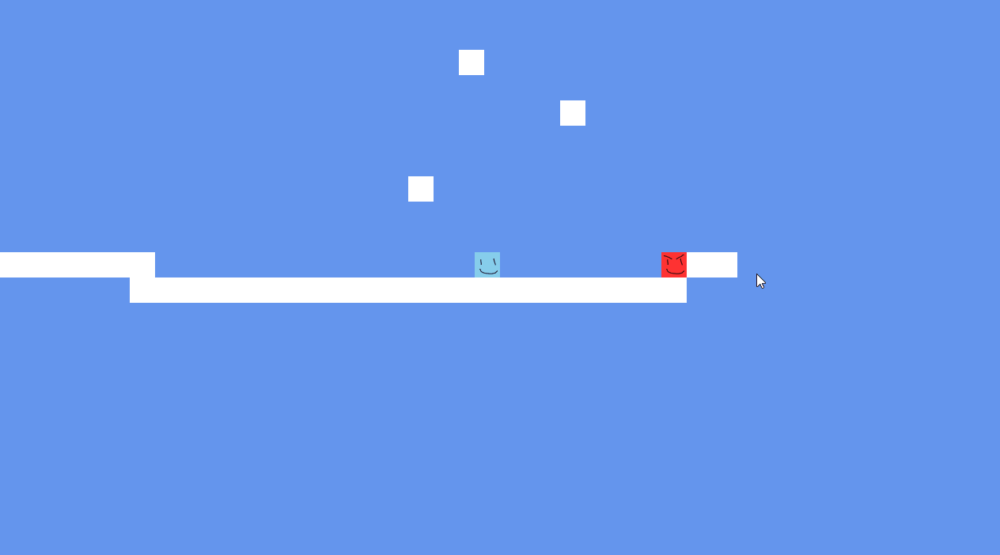
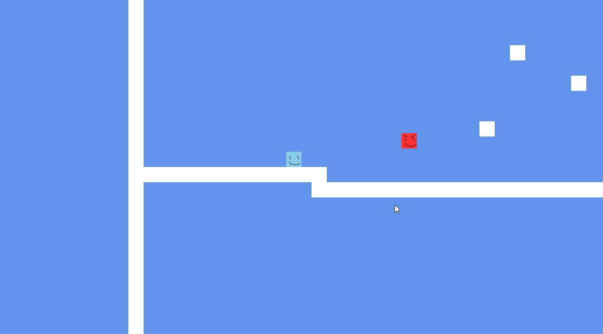
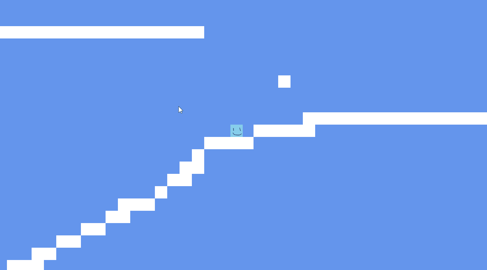
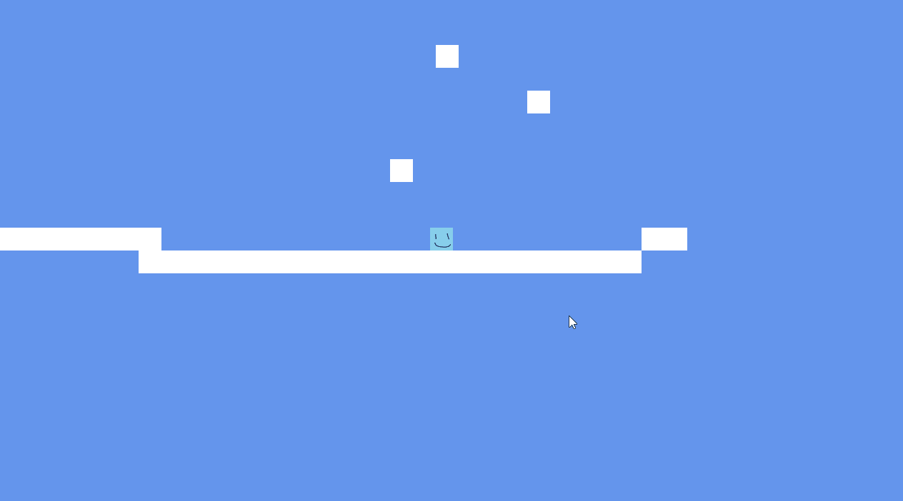
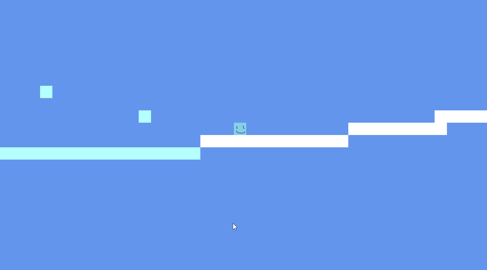

# 2D-Shooting-Platformer
A 2D shooting platformer game that I made using C# and the XNA/MonoGame framework over the summer of 2021.
The game introduces the applications of topics like continuous collision detection, pendulum physics and line line collision detection.
I also attempted to better organize the game's code for expandability.

## Features
- Shoot bullets at enemies with immersive feedback! (screen shake, squash and stretch, etc.)

- Shoot a sniper shot at enemies with infinite pierce!

- Use the grappling hook to swing around the environment!

- Press f to blink around the map!

- Slippery ice!

